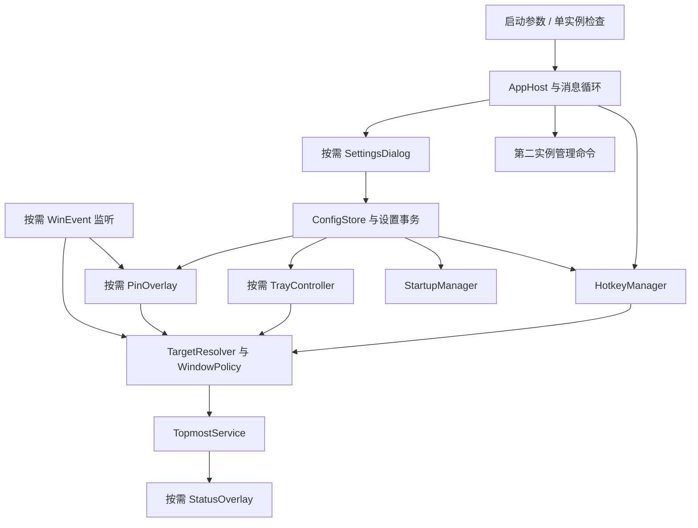

# QuietPin：Windows 轻量级窗口置顶工具技术实现文档

日期：2026-10-05（北京时间）  
状态：开发前设计；尚未实现或验证可执行程序。QuietPin 为暂定产品名，目录名保持 ping-tool。

## 1. 结论

选择 **C++20 + 原生 Win32 API + Windows 公共控件 + GDI**，后台进程和设置界面在同一可执行文件内。面向 Windows 11 x64，使用 Per-Monitor V2 DPI awareness。发布版本优先使用 MSVC Release 静态运行库，交付便携单文件 EXE；Windows 自带系统 DLL 不随包分发。

核心是事件驱动的 Windows 消息循环。默认没有主窗口、控制台、任务栏项、托盘图标或 Pin 按钮，不轮询键盘，不扫描全部窗口，不联网检查更新。默认全局快捷键切换前台窗口的实际 topmost 状态。

本设计包含全部必需功能，Pin 按钮安排在核心能力稳定之后完成。参考项目仅用于研究交互与边界，不复制其实现代码。

## 2. 调研结果与方案比较

### 2.1 已检查的参考方案

| 参考 | 已检查内容 | 借鉴点 | 本项目的设计取舍 |
| --- | --- | --- | --- |
| helliong/pinWindow | README、PinWindow.csproj、Program.cs、AppSettings.cs；源码快照 `45819874666c2f4069642d2a87895837b56c8a5e` | 前台窗口附近的非激活 Pin 按钮、全局快捷键、窗口事件跟随 | 不沿用默认可见托盘、.NET 自包含发布、更新检查及常驻按钮恢复轮询 |
| Microsoft PowerToys Always On Top | 官方功能文档及 AlwaysOnTop.cpp；源码快照 `1400fd8e999f381329e16e9df4084f7dc588c8a7` | 窗口筛选、排除程序、WinEvent、置顶状态与本工具管理记录分开 | 不引入 PowerToys 宿主、边框绘制、透明度或系统菜单扩展 |
| AutoHotkey v2 | 官方文档仓库 WinSetAlwaysOnTop 页面 | 根据当前状态反转；置顶并不保证覆盖其他置顶窗口 | 将行为直接实现为原生 API 调用，不要求用户安装或运行脚本环境 |
| WindowTop | 官方产品页 | 简便的窗口操作入口及清晰状态反馈 | 只借鉴交互原则，不增加画中画、透明度、暗色滤镜等功能；未审计其内部实现 |

PinWindow 当前源码使用 .NET 8 Windows Forms。Program.cs 中可以看到默认可见的 NotifyIcon、WinEvent 监听、16 ms 移动定时器和启用按钮时运行的 50 ms 恢复定时器。这些是参考项目的实现选择，不构成其性能优劣的测量结论。[PinWindow 源码](https://github.com/helliong/pinWindow/blob/45819874666c2f4069642d2a87895837b56c8a5e/Program.cs)

PowerToys 使用 topmost 状态与自身管理标记区分窗口，并通过窗口事件更新相关行为。本项目保留这类责任区分，采用更小的独立进程。[PowerToys 源码](https://github.com/microsoft/PowerToys/blob/1400fd8e999f381329e16e9df4084f7dc588c8a7/src/modules/alwaysontop/AlwaysOnTop/AlwaysOnTop.cpp)

### 2.2 技术栈取舍

下表是针对本需求的工程判断，尚无本项目的体积或内存实测。

| 方案 | 收益 | 代价 | 结论 |
| --- | --- | --- | --- |
| 原生 C++/Win32 | 直接使用窗口管理接口；没有额外 UI 运行时；容易控制空闲唤醒和窗口样式 | RAII、资源生命周期、DPI 布局及错误处理需要认真实现 | 采用 |
| C# WinForms | 设置界面开发方便；窗口管理仍可使用 P/Invoke | 框架依赖或自包含运行时增加发布成本 | 可行备用方案 |
| Rust + Windows bindings | 内存安全优势；可编译原生程序 | 本项目仍需处理大量 Win32 unsafe 边界，引入另一套工具链 | 可行但没有决定性需求收益 |
| WPF / WinUI 3 | 更丰富的界面能力 | 此工具设置界面简单，收益不足以支持额外框架成本 | 本期不采用 |
| Qt / Electron / WebView 宿主 | 跨平台或 Web UI 开发便利 | 本项目只面向 Windows，无必要引入这些依赖 | 不采用 |
| AutoHotkey 脚本 | 能快速验证快捷键置顶行为 | 完整设置、无托盘恢复入口、窗口身份管理与发布仍要单独设计 | 只作行为参考 |

## 3. 产品行为与默认值

| 项目 | 默认值 / 行为 |
| --- | --- |
| 置顶快捷键 | Ctrl + Alt + T；按下切换一次，长按不连续切换 |
| 设置快捷键 | Ctrl + Alt + Shift + T；可在设置中修改 |
| 退出快捷键 | Ctrl + Alt + Shift + Q；可在设置中修改 |
| 普通启动 | 直接后台运行，不显示主窗口、控制台、任务栏或托盘图标 |
| 托盘图标 | 关闭；主动开启后才创建 |
| Pin 按钮 | 关闭；主动开启后只跟随当前合格活动窗口 |
| 状态提示 | 开启；成功约 1.2 秒、失败约 2.5 秒，均不抢焦点；可整体关闭 |
| 开机启动 | 关闭；开启后在当前用户登录时后台启动 |
| 语言 | 首次根据 Windows 用户界面语言选择简体中文或 English；可手动切换 |
| 排除规则 | 初始无用户规则；内置保护规则始终生效 |
| 退出时置顶状态 | 尽力撤销本进程从非置顶改为置顶、且仍有有效管理记录的窗口 |

“开机启动”在桌面工具中指当前用户登录后启动，不是登录前运行的系统服务。Windows Run 启动时机也不保证立即执行。[Run 注册表文档](https://learn.microsoft.com/en-us/windows/win32/setupapi/run-and-runonce-registry-keys)

状态提示关闭后，后台置顶失败保持安静；设置界面的“最近操作结果”仍显示失败原因。配置保存、启动入口失效等必须由用户处理的错误在设置界面内显示，不弹抢焦点的操作错误框。

### 3.1 无托盘下的发现与恢复入口

提供以下命令行行为，具体解析由应用实现：

```text
QuietPin.exe             首次启动后台运行；已有实例时打开已有实例的设置
QuietPin.exe --settings  启动并打开设置，或通知已有实例打开设置
QuietPin.exe --exit      通知已有实例退出；没有实例时直接返回
QuietPin.exe --startup   登录启动专用，已有实例时安静返回
```

README 开头列出三个默认快捷键和设置入口。便携包提供打开设置的启动脚本；不通过首次弹窗破坏默认无主窗口行为。

若置顶快捷键注册失败，保留能注册的管理快捷键并打开设置，明确显示冲突。若设置与退出快捷键均注册失败，必须打开设置，避免出现没有控制入口的隐形进程。用户仍可用再次运行 EXE 或 `--settings` 恢复管理。注册失败后不持续自动重试，不尝试抢占其他程序快捷键。

## 4. 总体架构



核心模块：

| 模块 | 责任 |
| --- | --- |
| AppHost | 主线程、消息分发、资源初始化与有界退出；不含具体置顶规则 |
| InstanceGuard / InstanceEndpoint | 当前用户会话内单实例、有限管理命令、启动竞态处理 |
| HotkeyManager | 注册、验证、保存切换、注销；不使用低级键盘钩子 |
| TargetResolver | 获取当前窗口或已保存目标；核对窗口身份 |
| WindowPolicy | 系统窗口保护、用户排除规则、可见性与权限判断 |
| TopmostService | 读取真实状态、请求切换、异步确认、管理记录 |
| ForegroundTracker | 仅在托盘或 Pin 开启时跟踪外部前台窗口 |
| StatusOverlay | 短暂、非激活、鼠标穿透的状态提示 |
| PinOverlay | 可点击、非激活的小窗口；只表示当前目标 |
| SettingsDialog | 修改设置、排除规则、最近结果、退出按钮 |
| ConfigStore / StartupManager | 配置原子落盘、注册表启动项一致性 |
| Localization | 资源键到中英文本映射，无运行时翻译服务 |

默认一个 UI/消息线程。WinEvent 回调只筛选并投递消息，避免回调重入时进行配置读写、进程查询或窗口操作。若实现中发现进程查询影响响应，再使用一个按需工作线程；不提前引入线程池或常驻后台任务。

所有 HWND、HANDLE、HICON、HFONT、HBRUSH、WinEvent hook 使用明确所有者或 RAII 封装。窗口过程、WinEvent 回调和线程入口不允许 C++ 异常跨越系统调用边界。

## 5. 后台进程与单实例

### 5.1 隐藏宿主

主程序使用 Windows 子系统入口 `wWinMain`。建立一个不调用 ShowWindow 的普通顶层隐藏宿主，拥有 `WS_EX_TOOLWINDOW`，承接热键、定时器、实例命令及 Explorer 广播。设置窗口由它拥有，默认不出现在任务栏或 Alt+Tab 中；设置界面是用户主动打开的可交互窗口，应正常接受焦点。

此处有意使用隐藏顶层窗口，而不是只创建 message-only window：托盘恢复需要接收 `TaskbarCreated` 等广播；message-only 窗口不接收广播。默认仍没有可见窗口。[Windows Window Features](https://learn.microsoft.com/en-us/windows/win32/winmsg/window-features#message-only-windows)

消息循环在无事件时阻塞于 `GetMessageW`。对返回 -1 的错误和返回 0 的退出分别处理，不能使用把 -1 当成正常消息的循环条件。

### 5.2 单实例与管理命令

- 使用 `Local\\QuietPin.<用户SID>.Instance` 命名 mutex，保证同一用户、同一交互会话只运行一份。其他用户或其他会话可以有各自实例。
- 第二实例寻找本应用专用窗口类和用户标识，使用 `SendMessageTimeoutW` 发送固定的“设置 / 退出”命令。命令不携带文件路径或待执行字符串。
- 处理首实例持有 mutex 但尚未创建窗口的竞态：第二实例在有界时间内重试；达到超时给出当前实例无响应的结果，不继续启动第二个后台实例。
- 为 `--exit` 提供成功、无实例、超时/失败等明确退出码。
- 默认 `asInvoker`、`uiAccess=false`。不以管理员身份运行、不修改消息过滤器放宽跨完整性级别访问。若用户自行提升实例权限，普通权限第二实例的控制请求可能被 UIPI 拦截，需要显示可理解的错误，不能偷偷再启动一份。

## 6. 置顶行为与窗口筛选

### 6.1 唯一操作路径

快捷键、托盘菜单、Pin 按钮都调用同一个 `ToggleTarget(WindowIdentity)`，经过统一筛选，防止某个入口绕过程序排除或系统保护。

处理步骤：

1. 获取目标窗口；快捷键当时调用 GetForegroundWindow，不使用滞后的缓存。
2. 使用 `GetAncestor(..., GA_ROOT)` 获取该顶层窗口，不盲目跳到 GA_ROOTOWNER，避免把活动对话框替换成另一窗口。
3. 核对窗口存在、窗口线程/PID、可见且未最小化、属于当前会话且非本工具窗口。
4. 应用内置保护规则和用户排除规则。
5. 查询当前 `GWL_EXSTYLE & WS_EX_TOPMOST`，按当前真实状态选择置顶或取消置顶。
6. 在发送操作前再次核对身份；若目标已经关闭或身份改变，停止操作。
7. 请求改变 Z-order；确认状态后才更新管理记录和显示成功。

Windows topmost 只保证处于普通非置顶窗口之上。其他置顶窗口、独占全屏、安全桌面和应用自己恢复 Z-order 的行为都有边界，不进行循环强制置顶。[PowerToys 兼容性说明](https://learn.microsoft.com/en-us/windows/powertoys/always-on-top)

### 6.2 置顶请求

示意调用如下，属于开发设计，不是已验证实现：

```cpp
const HWND order = currentlyTopmost ? HWND_NOTOPMOST : HWND_TOPMOST;
const UINT flags = SWP_NOMOVE | SWP_NOSIZE | SWP_NOACTIVATE
                 | SWP_NOOWNERZORDER | SWP_ASYNCWINDOWPOS;
const BOOL accepted = SetWindowPos(target, order, 0, 0, 0, 0, flags);
```

异步标志用于减少目标线程失去响应时对本工具的阻塞；返回成功不直接等同于目标已达到期望状态。只有存在待确认请求时才启用短时单次检查，约 30/80/160/300 ms 核对真实样式；500 ms 内未达到期望状态则报告“窗口未响应或不支持此次操作”。发送失败立即保存 Win32 错误码。待确认期间同一窗口的新请求合并为有界待执行意图，禁止重入和无限重试。[SetWindowPos](https://learn.microsoft.com/en-us/windows/win32/api/winuser/nf-winuser-setwindowpos)

读取窗口样式时考虑返回 0 与失败的区别：预先清除 LastError，按 API 约定判断。操作不通过 SetWindowLongPtr 直接改 topmost 位，不移动或缩放目标，不使用 SetForegroundWindow 强行激活目标。

### 6.3 特殊系统窗口保护

综合判断，不能简单排除整个 explorer.exe：文件资源管理器恰好是应支持的程序。

- 排除 GetDesktopWindow / GetShellWindow 对应的窗口。
- 排除桌面宿主 `Progman`、`WorkerW`，任务栏 `Shell_TrayWnd`、`Shell_SecondaryTrayWnd` 及已确认的通知溢出/任务切换系统窗口类。
- 排除子窗口、非可见窗口、cloaked 窗口、菜单/工具提示/本工具 overlay 等非普通目标。
- 不全局排除所有 WS_EX_TOOLWINDOW 窗口，以免误伤正常工具程序；结合类名、owner 与实际用途处理。
- explorer.exe 的正常文件夹窗口允许通过，不依赖唯一窗口标题。
- 全屏或无标题栏窗口仍可通过快捷键置顶；Pin 按钮默认隐藏，避免覆盖内容。
- 不按“Chrome_WidgetWin_1”之类浏览器/Electron 通用窗口类进行排除。

## 7. 快捷键与冲突处理

使用 RegisterHotKey + WM_HOTKEY，并加入 MOD_NOREPEAT。系统负责全局热键通知，无需低级键盘 hook 或 GetAsyncKeyState 轮询。[RegisterHotKey](https://learn.microsoft.com/en-us/windows/win32/api/winuser/nf-winuser-registerhotkey)

设置中使用修饰键复选框（Ctrl、Alt、Shift、Win）加主键选择控件，支持字母、数字、常用功能键等明确允许的 VK。至少要求一个修饰键；不支持只有修饰键、不允许 F12、拒绝已知系统保留组合；组合是否合法最终以注册结果为准。Win 组合标注可能与系统冲突。规范化后检查本应用三个组合不重复。

保存策略：

1. 输入校验完成后，保持已有快捷键有效。
2. 对变化且不占用本应用旧组合的快捷键，以临时 ID 先注册；失败撤销本次临时注册并保留原配置。
3. 未变更的组合保持原注册，不尝试重复注册。
4. 若用户交换本应用已有的快捷键，识别这种内部占用，在设置窗口保持打开时有序释放受影响组合，再注册新组合；失败尽力恢复原组合。
5. 全部注册成功且设置事务提交后才释放废弃注册。消息分发按当前有效 ID 映射，不能假定 ID 永不变化。
6. 恢复旧组合也可能被外部程序抢占；此时设置窗口保持打开，列出实际生效组合并保留命令行恢复入口，不能虚假声称已完整回滚。

关闭设置窗口只返回后台。设置内始终提供“退出 QuietPin”按钮，与窗口关闭按钮的含义明确区分。

## 8. 托盘交互

仅在用户开启时调用 Shell_NotifyIconW 创建图标，关闭时 NIM_DELETE。使用现代 NOTIFYICON_VERSION_4，支持鼠标和键盘打开菜单。菜单至少包含：置顶/取消当前窗口、设置、退出。无有效目标时禁用置顶项。

托盘交互会把前台切到 Shell 或菜单，因此开启托盘时注册轻量前台变化监听，保存最近外部前台窗口。菜单打开时冻结其目标身份，菜单执行前再校验；期间出现了其他普通程序的新前台窗口则重新明确目标或取消，不误操作陈旧目标。点击菜单不能再次用 GetForegroundWindow 得到任务栏后尝试置顶。

只维护最近前台目标，不枚举全部窗口。托盘菜单若必须调用 SetForegroundWindow 以正确关闭菜单，只对本工具菜单宿主使用；状态提示和 Pin 按钮不这样处理。

Explorer 重启时，隐藏宿主收到 TaskbarCreated；只有设置仍开启托盘时才重新添加图标。图标添加失败可有界重试，随后在设置里显示失败，不启用永久恢复轮询。[通知区域文档](https://learn.microsoft.com/en-us/windows/win32/shell/notification-area)

## 9. 状态提示

使用独立 `WS_POPUP` 小窗口，扩展样式包含 `WS_EX_TOOLWINDOW | WS_EX_NOACTIVATE`；透明绘制需要时添加 WS_EX_LAYERED。显示使用 SW_SHOWNOACTIVATE 和 SWP_NOACTIVATE；禁止调用激活 API。

提示不依赖托盘、系统通知中心或 AUMID。用短文本描述“已置顶 / 已取消置顶 / 此程序已排除 / 无法操作此窗口”。提示放在目标所在显示器的工作区内，避开主要标题按钮；目标不可用时放在当前操作显示器内。

提示窗口需要经过实际跨进程鼠标命中测试确认穿透行为；不把 WS_EX_TRANSPARENT 单独等同于鼠标穿透。提示使用可验证的 layered-window 命中策略，处理 WM_MOUSEACTIVATE，并确保用户点击提示区域时底层窗口能接收操作。

连续结果复用一个提示窗口，更新文本并重新设置结束时间。关闭提示功能后隐藏窗口、取消计时，不为一次反馈重新创建线程。失败结果无论是否显示提示都记录为设置里的最近结果。[窗口扩展样式](https://learn.microsoft.com/en-us/windows/win32/winmsg/extended-window-styles)

## 10. 可选 Pin 按钮

### 10.1 窗口与点击

一个独立的、小尺寸 overlay，出现在目标窗口顶部边缘附近，不注入目标进程、不修改它的原生标题栏或系统菜单。

样式包含 WS_EX_TOOLWINDOW 和 WS_EX_NOACTIVATE。WM_MOUSEACTIVATE 返回 MA_NOACTIVATE，使点击消息继续送达而不激活按钮；不能用 MA_NOACTIVATEANDEAT，否则点击被丢弃。Pin 本体接收点击，不能照搬提示的鼠标穿透设置。[WM_MOUSEACTIVATE](https://learn.microsoft.com/en-us/windows/win32/inputdev/wm-mouseactivate)

按钮按真实 WS_EX_TOPMOST 状态呈现两种可区分状态，使用 GDI 绘制矢量图形，避免依赖 Emoji 字体。提供文本提示和无障碍名称；可通过快捷键获得等价能力。按下时保存目标身份，释放时核对同一目标仍然有效，防止切换窗口过程中点错目标。

只有当前活动目标合格时才显示。切换目标、进入本工具设置、最小化、关闭、虚拟桌面切换、锁屏或目标变成排除程序时立即隐藏。按钮不作为目标窗口的跨进程子窗口，避免 SetParent 引发 DPI/生命周期问题。临时置顶只用于使按钮可见；前台条件失效即隐藏，避免在其他应用上残留。

### 10.2 事件驱动跟随

用户启用后注册精确范围的 out-of-context WinEvent：前台变化、当前目标的位置变化、移动/缩放开始与结束、最小化、隐藏、销毁。位置相关事件尽量按当前目标 PID/TID 限定，再过滤 HWND、OBJID_WINDOW、CHILDID_SELF，避免浏览器内部大量子对象事件触发布局。[SetWinEventHook](https://learn.microsoft.com/en-us/windows/win32/api/winuser/nf-winuser-setwineventhook)

回调只设置更新标记并投递一次 WM_APP 消息。事件密集时合并为一次布局刷新；进入移动/缩放过程时允许 16–33 ms 的临时补偿计时，结束立即停止。布局不变不重复 SetWindowPos 或重绘。不添加默认 50 ms 的常驻恢复扫描。

若遇到特定应用遗漏事件，先复现并记录，再为该兼容场景提供有界补偿；不得为个别异常增加默认全局高频轮询。Pin 关闭后卸载其 hook、隐藏并销毁按钮、停止所有跟随计时器。托盘开启需要的前台 hook 由独立的共享订阅计数管理，不被误卸载。

### 10.3 位置、DPI 与多显示器

- 在 manifest 中声明 PerMonitorV2，全部 HWND 创建前即生效；设置窗口和 overlay 处理 WM_DPICHANGED，按推荐矩形与新 DPI 重新布局。[DPI awareness 文档](https://learn.microsoft.com/en-us/windows/win32/hidpi/setting-the-default-dpi-awareness-for-a-process)
- 尽量使用 DwmGetWindowAttribute 的 DWMWA_EXTENDED_FRAME_BOUNDS 取得可见边界，失败回退 GetWindowRect。所有用于定位的数据明确转换到物理屏幕坐标，不混用 DIP 与像素。
- MonitorFromWindow / GetMonitorInfo 确定目标显示器与工作区，支持左侧显示器负坐标、主显示器切换和热插拔。
- 按钮尺寸以 DIP 定义，换算只做一次。**不能盲目用 GetDpiForWindow(target) 作为显示器 DPI**：DPI-unaware 窗口可能返回 96，system-aware 窗口可能返回系统 DPI。[GetDpiForWindow](https://learn.microsoft.com/en-us/windows/win32/api/winuser/nf-winuser-getdpiforwindow)
- 将本工具的 PerMonitorV2 overlay 在隐藏/非激活状态下放到目标显示器，使用自身 GetDpiForWindow 和 WM_DPICHANGED 获取有效 DPI，再完成尺寸与显示位置计算；目标窗口的 DPI 仅作辅助信息。
- 默认位置优先位于顶边外侧，尽量避开关闭、最大化、最小化及浏览器标签区域。屏幕顶部无外侧空间时采用可配置顶部边缘偏移，保留右侧标题按钮区域。
- 不承诺识别所有自绘标题栏。设置中提供按钮水平/垂直偏移和恢复默认；特别窄、全屏或无安全位置时隐藏按钮，快捷键仍然可用。
- DWM cloaking、会话锁定/恢复、显示拓扑变化后重新核对前台与位置；虚拟桌面中不可见的目标不显示按钮。需要更精细判断时使用公开虚拟桌面接口，不依赖未公开 Shell 接口。

## 11. 排除程序与管理员窗口

### 11.1 排除规则

设置提供列表、添加 EXE、按进程名添加、删除规则。规则类型为：完整 EXE 路径精确匹配，或带 .exe 的进程文件名精确匹配；均不区分大小写，不做隐式子串匹配。路径规范化，允许 Unicode 和空格；同名 EXE 若只想排除某一安装位置则选择完整路径。

通过 GetWindowThreadProcessId、OpenProcess(PROCESS_QUERY_LIMITED_INFORMATION)、QueryFullProcessImageNameW 查询进程。缓存按 PID 与进程创建时间区分，不能只按 PID 长期缓存。查询失败时保守拒绝此次操作并说明无法识别程序，避免绕过完整路径排除规则。

已排除程序不得执行快捷键、托盘或 Pin 的置顶操作，也不显示 Pin。保存新排除规则时，对本工具仍管理的匹配窗口尽力撤销自己添加的置顶并移除按钮；本来就置顶但未由本工具改变的窗口不改动。清理失败保留结果，不循环重试。内置 Shell 保护不在可删除用户规则列表中。

### 11.2 权限边界

普通权限运行。读取目标 token 的完整性级别与本工具比较；目标级别更高时拒绝操作，提示“此窗口权限较高，当前无法操作”。识别失败和 API 返回拒绝访问同样归为受限操作，不崩溃、不自动触发 UAC。

较高权限目标不显示可操作 Pin，以免暗示必然成功。受保护进程、目标关闭、无响应、无前台窗口及无效句柄都有独立结果类型。排除/权限/不可用属于正常业务结果，不能由未经捕获的异常终止进程。

## 12. 配置、开机启动与设置事务

### 12.1 配置格式

使用 `%LOCALAPPDATA%\\QuietPin\\settings.ini`，明确版本、类型、默认值及长度上限。INI 足够表达本项目设置，不引入 JSON 库。以 UTF-16LE BOM 序列化，支持中文路径；Windows profile API 读取时有明确缓冲区和截断检查。若实现采用小型自有解析器，只支持本文件定义的有限语法，不扩展成通用 INI 框架。

示例（字段为设计稿）：

```ini
[General]
SchemaVersion=1
Language=zh-CN
ShowStatus=1
ShowTray=0
ShowPin=0
StartWithWindows=0

[Hotkeys]
ToggleModifiers=3
ToggleKey=84
SettingsModifiers=7
SettingsKey=84
ExitModifiers=7
ExitKey=81

[Pin]
SizeDip=24
OffsetXDip=0
OffsetYDip=0

[Exclusions]
Count=1
Type0=ExecutableName
Value0=example.exe
```

修饰键使用 Win32 位值（Alt=1、Ctrl=2、Shift=4、Win=8），MOD_NOREPEAT 不写入用户配置。文件限定例如 64 KiB、最多 128 条排除规则，拒绝越界数值。未知新版本不覆盖原文件；损坏配置保留备份并打开设置提示恢复默认，不静默毁掉用户设置。

写入同目录临时文件、检查写入结果并 FlushFileBuffers，最后 MoveFileExW 替换原文件。不能直接在原配置上逐字段覆盖导致崩溃后留下半份配置。若使用 profile API，避免读取旧缓存的问题；临时文件写入路径与最终读取生命周期须测试。

### 12.2 登录启动

只写入 `HKCU\\Software\\Microsoft\\Windows\\CurrentVersion\\Run` 下本工具自己的值。内容是带双引号的绝对 EXE 路径，加 `--startup`；关闭时只删除该值。检查长度、写入错误与现有值归属，不能删除同名但内容属于其他软件的值。

设置打开时比较注册表实际状态和配置意图，解释 Windows 启动项被外部禁用或 EXE 已移动的情况。开启时用当前 EXE 绝对路径更新。文件移动后用户需要重新开启/保存启动设置；本期不做安装目录自动追踪、计划任务或服务。

### 12.3 设置保存的一致性

设置可能同时改变全局快捷键、注册表启动项、磁盘配置和 UI 模块，不能简单依次写入后忽略中途失败。

1. 在内存构造并校验完整候选配置；保存前配置仍为旧版本。
2. 准备新热键注册和临时配置文件；记录旧启动项原始内容。
3. 更新启动项；失败时撤销准备操作，仍显示旧设置。
4. 原子替换配置文件；失败时尽力恢复启动项、撤销准备的热键，并报告实际状态。
5. 提交运行时配置，再按需启停托盘/Pin/提示，释放旧热键。
6. 模块创建失败时明确显示“配置已保存，但当前功能未启用”的实际状态，不冒充完全成功。

注册表与文件系统没有本项目可依赖的跨资源原子事务。回滚失败必须可见；下次启动执行一致性核对，不能声称所有失败都能百分之百恢复。程序不自动删除未知注册表内容。

## 13. 设置界面

使用原生 modeless 对话框和公共控件，按需创建，单实例复用。固定功能分组：

1. 快捷键：置顶、打开设置、退出；显示当前有效组合与冲突结果。
2. 后台与反馈：状态提示、登录启动、托盘、Pin 四个开关。
3. Pin 位置：启用时可调整尺寸与水平/垂直偏移，提供恢复默认。
4. 排除程序：规则列表、添加 EXE/进程名、删除。
5. 语言：中文 / English，所有菜单、提示、错误和按钮一起更新。
6. 底部操作：保存、关闭、退出 QuietPin；显示最近操作结果。

支持 Tab 顺序、键盘操作、Escape 关闭、文本标签和高对比度。字体使用系统 UI 字体（按 DPI 创建）；两种语言分别验证布局，不按中文字数推测 English 宽度。高 DPI、长路径和错误文字可换行或滚动，不能截掉关键说明。Windows 11 圆角可通过 DWM 在支持时启用，失败回退普通原生窗口；核心功能不依赖外观特效。

## 14. 窗口身份、退出和资源清理

### 14.1 管理记录

记录 HWND、PID、窗口线程 ID、进程创建时间、原状态、期望状态及本次操作代号。对于本工具从非置顶成功改为置顶的窗口，可增加唯一窗口属性标记，配合进程内记录减少 HWND 销毁再复用造成的误操作。标记设置失败时不进行未经身份保证的退出恢复。

操作前、异步确认前和退出恢复前都核对身份。销毁事件及时删除记录；Pin 关闭时，只有存在本工具管理窗口才按需监听相关生命周期事件，不为零管理窗口保持跟随监听。

对原本由应用或其他工具置顶的窗口，用户再次按快捷键可以取消它的实际置顶状态，但本工具不把它记为自己新增的置顶，也不在退出时擅自恢复。

Windows 不提供可靠的“最后由哪个工具改变 topmost”所有权信息。其他工具把同一窗口再次设为相同置顶状态时可能无法识别。退出恢复是基于本工具记录的尽力恢复，不承诺与多个置顶工具同时运行时完全无冲突；发现实际状态已偏离本工具预期则放弃恢复，不进行全局扫描或写入跨进程指针。

### 14.2 完整退出

设置按钮、全局退出快捷键、托盘菜单、第二实例 `--exit` 都进入同一退出路径：停止接收新操作 → 隐藏 overlay → 注销热键 → 卸载 hook → 撤销本工具仍能安全识别的新增置顶 → 删除托盘 → 释放 UI/GDI/句柄 → 销毁隐藏宿主 → PostQuitMessage → 释放 mutex。

退出清理有整体时间预算（目标 1 秒）；单个窗口无响应不能无限阻塞。失败记录不阻止进程退出。退出不删除开机启动设置：用户开启的是下次登录启动，退出仅终止本次进程。

崩溃/强制结束无法保证撤销已改变的窗口状态。不把 HWND 持久化后在下次启动盲目恢复；残留状态可通过再次对该窗口按置顶快捷键取消。

## 15. 轻量目标与测试方法

以下是目标，不是已达到的测量结果。测试使用 Release x64、非调试器环境，分别记录默认后台、托盘开启、Pin 静止、Pin 拖动与设置打开。

| 指标 | 首版目标 | 测量方式 |
| --- | --- | --- |
| 默认空闲 CPU | 60 秒平均接近 0%，参考目标 <0.1% | 进程 CPU 时间差 / 采样时长，报告单核等价值与逻辑核数 |
| 默认私有内存 | 稳态 Private Bytes 尽量 ≤15 MiB | 启动稳定后取多次值；另报 Working Set，不混为同一指标 |
| EXE 大小 | 尽量 ≤2 MiB | Release 发布实际文件大小；记录编译器及静态运行库配置 |
| 默认空闲定时器 | 无常驻周期定时器 | 审计代码及消息/计时器日志；操作确认与提示计时为短时例外 |
| 核心响应 | 正常响应窗口置顶可见效果目标 ≤100 ms | 热键接收与状态确认时间戳；异步失败上限另报 |
| Pin 跟随 | 正常拖动时尽量 1–2 帧内跟随 | 录屏与事件日志；100%、150%、200% 混合 DPI |
| 完整退出 | 无响应目标存在时仍有界结束 | 模拟挂起窗口、计时及进程检查 |
| 长时间稳定性 | 2 小时反复操作无持续句柄增长或残留按钮 | GDI/User/Handle 数与 Private Bytes 趋势 |

预期默认态：一个后台进程、一个消息线程、一个隐藏宿主和单实例句柄；无设置窗口、无托盘、无 Pin、无网络连接。具体句柄数量以系统调用实测为准，不以目标表代替结果。

## 16. 需求覆盖与验收

| ID | 需求 | 验收方式 | 阶段 |
| --- | --- | --- | --- |
| CORE-01 | 活动窗口置顶与再按取消 | 两个窗口互相遮挡；按两次验证实际 WS_EX_TOPMOST | 1 |
| CORE-02 | 默认 Ctrl+Alt+T 且长按不重复 | 热键操作、长按及释放再按 | 1 |
| CORE-03 | 后台启动无主窗口/控制台/任务栏/托盘 | 首次普通启动观察桌面与任务栏 | 1 |
| CORE-04 | 单实例 | 连续和并发启动，只留一个进程；再次运行打开设置 | 1–2 |
| SAFE-01 | Shell/桌面/任务栏保护 | 对保护类测试均拒绝；Explorer 文件夹仍可置顶 | 1 |
| SAFE-02 | 管理员及受限目标不崩溃 | 普通工具对提升窗口执行，得到明确失败结果 | 1 |
| SAFE-03 | 目标销毁/无响应/句柄复用安全 | 受控 Win32 测试窗口销毁与挂起 | 1、5 |
| CFG-01 | 修改置顶快捷键并持久化 | 保存、重启、验证新组合与旧组合释放 | 2 |
| CFG-02 | 设置快捷键与管理恢复入口 | 无托盘下打开；模拟所有热键冲突后仍可恢复 | 2 |
| CFG-03 | 设置关闭回后台；设置里可彻底退出 | 关闭窗口仍运行，退出按钮进程消失 | 2 |
| CFG-04 | 全局退出快捷键 | 默认无托盘模式下退出且注销热键 | 2 |
| CFG-05 | 状态提示开关 | 关闭后操作无提示，最近结果仍可查 | 2 |
| CFG-06 | 开机启动开关 | HKCU 正确引用路径；登录验证；关闭仅移除自己的值 | 2 |
| CFG-07 | 托盘图标开关 | 默认无图标；主动开启/关闭即时生效 | 3 |
| CFG-08 | Pin 按钮开关 | 默认无按钮；关闭后 hook/跟随计时器撤销 | 4 |
| CFG-09 | 中文 / English | 所有界面、菜单、提示和错误同步翻译 | 2–4 |
| CFG-10 | 配置损坏/写入失败可恢复 | 故障注入与配置保留；不留隐形不可控进程 | 2、5 |
| UX-01 | 短暂提示不抢焦点且不阻挡点击 | 记录前台 HWND 与鼠标操作结果 | 3 |
| TRAY-01 | 托盘置顶/设置/退出 | 操作冻结目标，不置顶 Shell 或设置窗口 | 3 |
| TRAY-02 | Explorer 重启恢复托盘 | 重启 Explorer；仅在开关开启时恢复 | 3 |
| EXCL-01 | 支持 EXE 路径/文件名排除 | 三个操作入口都拒绝，Pin 隐藏 | 2–4 |
| EXCL-02 | 排除规则变更即时生效 | 新增/删除、同名不同路径、中文路径验证 | 2–4 |
| PIN-01 | 当前活动窗口附近按钮可切换置顶 | 点击两次；目标焦点不被按钮夺取 | 4 |
| PIN-02 | 移动/缩放/最大化/还原/关闭跟随 | 连续窗口操作无残留或点错目标 | 4 |
| PIN-03 | 多显示器与 DPI | 混合 DPI、负坐标、显示器热插拔、跨屏移动 | 4、5 |
| PIN-04 | 自绘标题栏与全屏降级 | Chrome/Electron 自绘窗口；无安全位置隐藏按钮 | 4、5 |
| COMPAT-01 | Win32/浏览器/Explorer/Electron | 记事本、Chrome/Edge、资源管理器、VS Code 分别操作 | 5 |
| PERF-01 | 低资源且无大型运行时依赖 | 记录第 15 节测量；检查导入 DLL 与发布包 | 5 |
| EXIT-01 | 退出清理与尽力撤销新增置顶 | 有多个受管理窗口时退出；无残留进程/托盘/按钮 | 5 |

首版所有必需能力纳入交付；可选 Pin 作为阶段 4，不能以“可选”为由省略关闭开关或遗留无效设置项。支持范围以实际测试清单说明，不宣称所有桌面软件、系统保护窗口或独占全屏都能操作。

## 17. 实施顺序与建议目录

每阶段交付可运行能力，先解决后台控制与恢复，再加入 UI 附加功能。

| 阶段 | 交付 | 完成标准 |
| --- | --- | --- |
| 1. 后台核心 | 原生工程、隐藏宿主、单实例、默认热键、筛选、异步置顶 | 默认无可见 UI，核心与权限边界测试通过 |
| 2. 可管理后台 | 设置、热键事务、语言、INI、排除规则、登录启动、退出 | 无托盘仍能修改/恢复/退出；配置保存与失败处理可验证 |
| 3. 可选反馈 | 非激活提示、可选托盘、正确托盘目标、Shell 重启恢复 | 所有开关生效，提示不夺焦点 |
| 4. Pin | 非激活可点击按钮、跟随、DPI、多屏、偏移 | 移动关闭无残留，跨屏尺寸与位置正确，关闭后无跟随负担 |
| 5. 验收发布 | 测试宿主、实测、兼容矩阵、Release 包、使用说明 | 必需需求逐项有证据，交付 EXE/源码/文档/校验值 |

建议源码目录（尚未创建）：

```text
CMakeLists.txt
src/
  main.cpp
  AppHost.cpp/.h
  InstanceGuard.cpp/.h
  HotkeyManager.cpp/.h
  WindowPolicy.cpp/.h
  TopmostService.cpp/.h
  ConfigStore.cpp/.h
  StartupManager.cpp/.h
  ForegroundTracker.cpp/.h
  SettingsDialog.cpp/.h
  StatusOverlay.cpp/.h
  PinOverlay.cpp/.h
  Localization.cpp/.h
resources/
  app.manifest
  app.rc
tests/
  policy_tests.cpp
  config_tests.cpp
  window_test_host.cpp
scripts/
  build.ps1
  open-settings.cmd
docs/
  technical-design.zh-CN.md
  verification.zh-CN.md
README.md
```

主构建使用 CMake 和 Windows SDK；正式交付使用 MSVC。当前环境已发现 CMake 和 MinGW g++，尚未确认 MSVC/Windows SDK 可用。若开发时先用 MinGW 验证，不把它的结果冒充 MSVC 发布验证；CMake、编译器及 SDK 的具体版本在实施前通过当前文档与本机工具检查记录。

单元测试聚焦纯策略、配置解析、规则匹配、热键输入验证及坐标计算。窗口行为用受控 Win32 测试宿主验证焦点、topmost、权限失败和销毁竞态；多屏、实际软件及登录启动需要真实 Windows 验收。不能仅通过测试一个 SetWindowPos 调用就宣称产品兼容完成。

## 18. 本期边界与待验证风险

- 不做网络服务、账户、遥测、自动更新、窗口内容采集或代码注入。
- 不做系统服务、驱动、强制提权或安全桌面操作。
- 不做透明度、画中画、跨重启窗口规则或所有窗口的持久置顶恢复。
- 原生 UI 的 Windows 11 体验优先通过字体、间距、DPI、系统控件和焦点行为实现，不为设置界面引入大框架。
- 高权限/受保护窗口、多个置顶工具同时运行、独占全屏以及异步 Z-order 请求必须通过真实环境测试；设计包含失败路径，但尚无通过记录。
- 任意自绘标题栏不存在统一可用的空闲位置 API，Pin 采用安全位置与偏移的降级设计，快捷键不依赖按钮。
- 未签名 EXE 的 SmartScreen 提示与发布信誉有关；代码签名属于发布阶段选项，不自动购买证书，也不把未签名构建描述为已签名发行版。
- Windows 11 x64 是首要验收平台。ARM64 可在后续用同一原生架构编译，但本期未经过实机测试，不承诺原生 ARM64 包。

## 19. 调研来源与文档核对记录

2026-10-05 已通过 Context7 的官方远程 MCP 执行 `resolve-library-id`，选用高信誉 Windows API 文档库 `/websites/learn_microsoft_en-us_windows_win32_api`（查询时报告 377423 个代码片段、评分 71.77）。分别查询了置顶/异步 Z-order、全局快捷键、非激活窗口与 DPI 行为；PerMonitorV2 和目标窗口 DPI 返回值又用 Microsoft 原文复核。Context7 结果是文档依据，不等于本项目运行验证。

参考项目及行为说明：

- [PinWindow 仓库](https://github.com/helliong/pinWindow)
- [PinWindow 工程文件快照](https://github.com/helliong/pinWindow/blob/45819874666c2f4069642d2a87895837b56c8a5e/PinWindow.csproj)
- [PowerToys Always On Top 官方文档](https://learn.microsoft.com/en-us/windows/powertoys/always-on-top)
- [PowerToys Always On Top 源码目录](https://github.com/microsoft/PowerToys/tree/1400fd8e999f381329e16e9df4084f7dc588c8a7/src/modules/alwaysontop)
- [AutoHotkey 官方 WinSetAlwaysOnTop 文档源码](https://github.com/AutoHotkey/AutoHotkeyDocs/blob/v2/docs/lib/WinSetAlwaysOnTop.htm)
- [WindowTop 官方产品说明](https://windowtop.info/)

原生 API 的其余依据：

- [GetWindowLongPtrW](https://learn.microsoft.com/en-us/windows/win32/api/winuser/nf-winuser-getwindowlongptrw)
- [SendMessageTimeoutW](https://learn.microsoft.com/en-us/windows/win32/api/winuser/nf-winuser-sendmessagetimeoutw)
- [DwmGetWindowAttribute](https://learn.microsoft.com/en-us/windows/win32/api/dwmapi/nf-dwmapi-dwmgetwindowattribute)
- [MonitorFromWindow](https://learn.microsoft.com/en-us/windows/win32/api/winuser/nf-winuser-monitorfromwindow)
- [QueryFullProcessImageNameW](https://learn.microsoft.com/en-us/windows/win32/api/winbase/nf-winbase-queryfullprocessimagenamew)
- [GetPrivateProfileStringW](https://learn.microsoft.com/en-us/windows/win32/api/winbase/nf-winbase-getprivateprofilestringw)
- [MoveFileExW](https://learn.microsoft.com/en-us/windows/win32/api/winbase/nf-winbase-movefileexw)

下一步为依据此设计建立 GSD 项目上下文、需求追踪与实施路线，再执行阶段 1。所有性能目标、兼容判断和发布结论都应在开发后的 verification 文档中填入实测证据。
